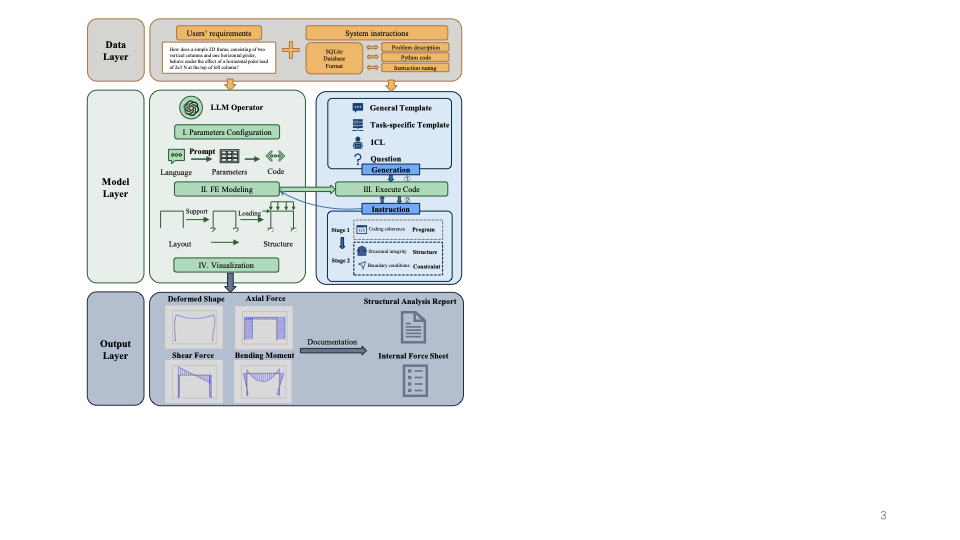
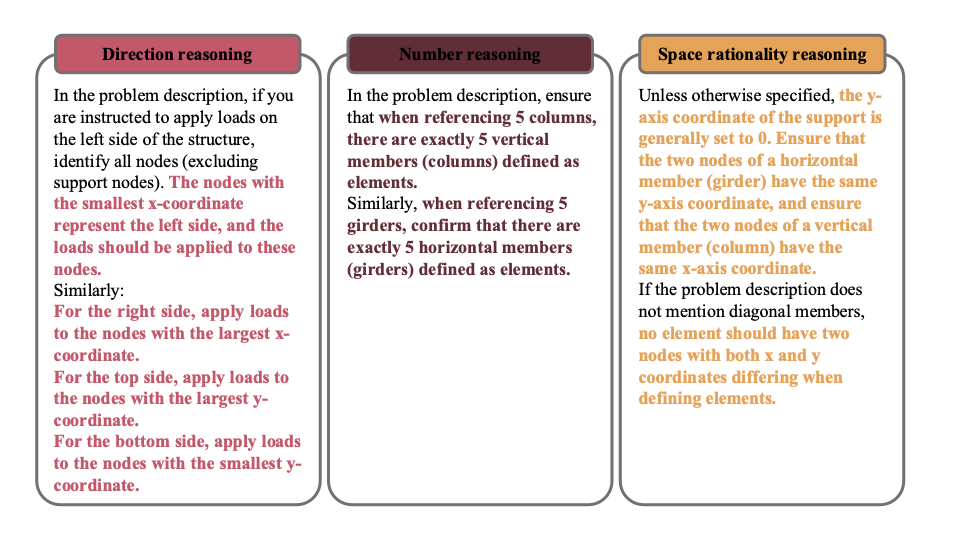
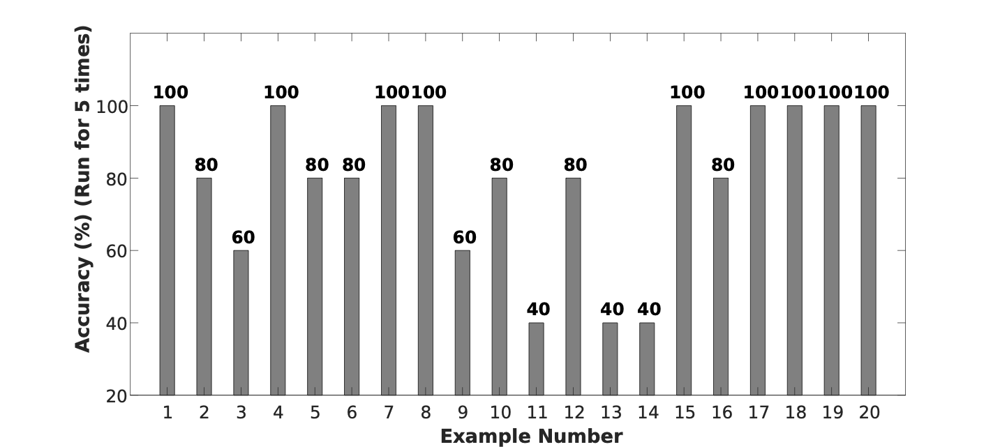

# Integrating Large Language Models for Automated Structural Analysis

## Framework

<p align="center">
  
</p>

## Installation

## Instruction Examples

<p align="center">
  
</p>

## Results

<p align="center">
  
</p>

## Citation

```bibtex
@article{liang2025integrating,
  title={Integrating Large Language Models for Automated Structural Analysis},
  author={Liang, Haoran and Kalaleh, Mohammad Talebi and Mei, Qipei},
  journal={arXiv preprint arXiv:2504.09754},
  year={2025}
}
```